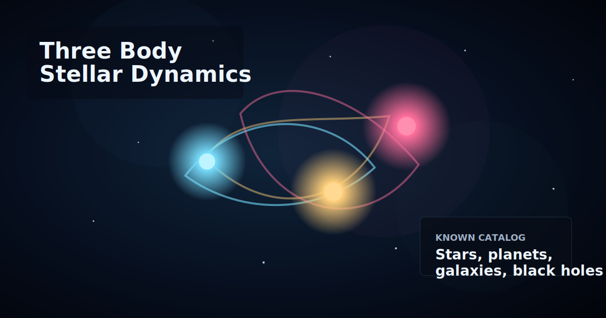

# Three Body Stellar Dynamics

[](https://github.com/souravpanda25/three_body_simulation/actions/workflows/static-check.yml)



An interactive browser simulation of gravitational star systems, black holes, trails, particle bursts, and a cinematic cosmic catalog view.

## Live Demo

```text
https://souravpanda25.github.io/three_body_simulation/
```

## Features

- Newtonian gravity using AU, solar masses, and years
- Stable three-body figure-eight preset
- Alpha Centauri and Sirius-inspired systems
- Trinary black-hole system
- Cinematic camera with zoom and drag controls
- Glow trails and collision particle bursts
- Mass, time, trail, camera, and catalog density controls
- Known Catalog mode with named real objects and generated discovered-object populations

## Run Locally

Open `index.html` directly in a browser, or run a small local server:

```powershell
cd "D:\New folder"
python -m http.server 5173 --bind 127.0.0.1
```

Then open:

```text
http://127.0.0.1:5173/index.html
```

## GitHub Pages

If GitHub Pages is enabled, the app can run from:

```text
https://souravpanda25.github.io/three_body_simulation/
```

## About The Catalog Mode

The Known Catalog mode includes named real objects such as Sgr A*, M87*, Sirius, Alpha Centauri, Proxima b, Orion Nebula, Andromeda, and TON 618.

There is no single complete public database of every cosmic object ever discovered, and a browser cannot realistically simulate gravity for millions or billions of objects at once. So the app uses a physically simulated core system plus a large visual catalog layer representing discovered populations like stars, exoplanets, minor planets, nebulae, galaxies, quasars, and black-hole candidates.

## Tech

Built with plain HTML, CSS, and JavaScript. No framework or build step required.

## Roadmap

See [ROADMAP.md](ROADMAP.md) for planned upgrades.

## Contributing

Ideas, bug reports, and feature requests can be added through GitHub Issues. Good first improvements include better mobile controls, more real object presets, sound effects, and richer black-hole visuals.

## Releases

See [CHANGELOG.md](CHANGELOG.md) for version notes.
